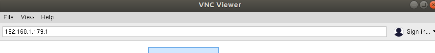
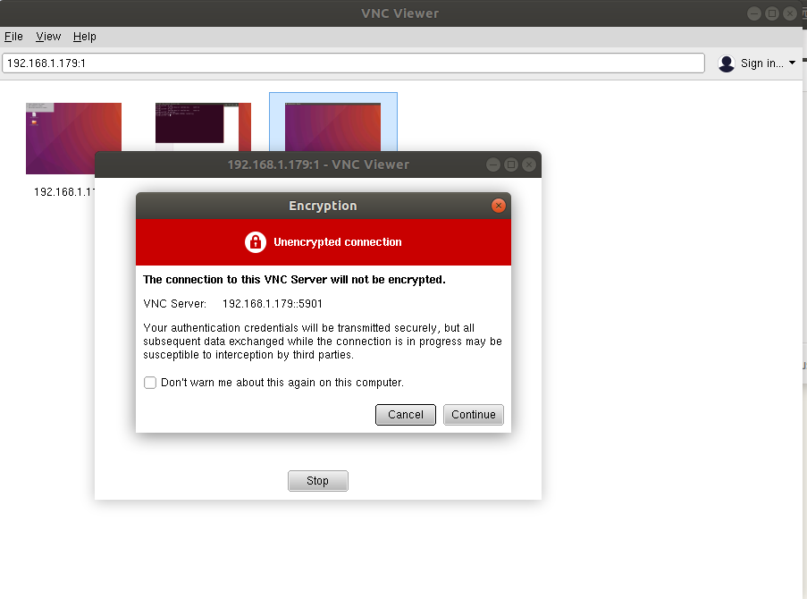
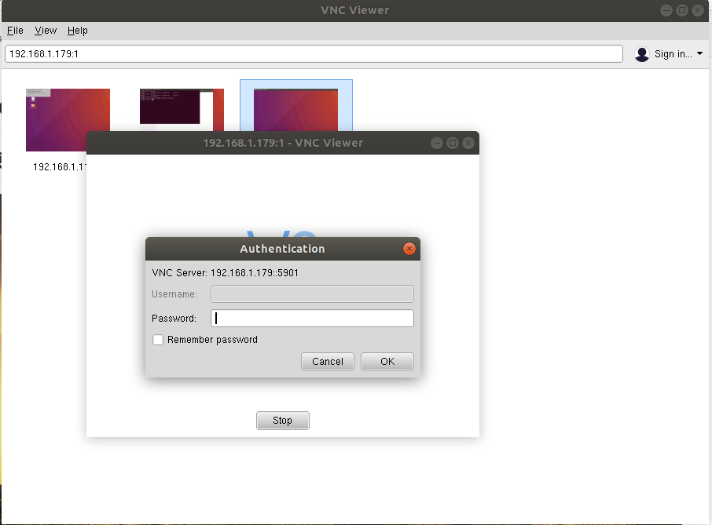
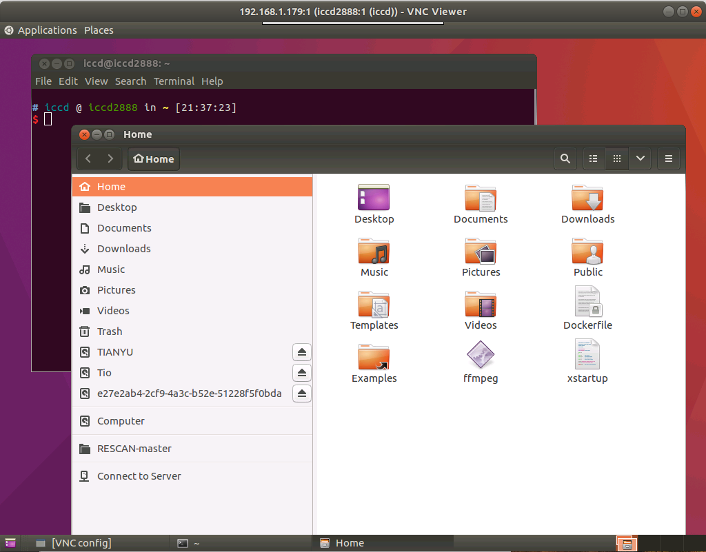

# Ubuntu 安装使用vnc

1. 在需要被远程桌面连接的主机上安装vnc4server

``` sudo apt install vnc4server xrdp ```

2. 安装完成后使用启动    

使用下边命令开启一个桌面服务器，第一次启动需要设置连接密码，按要求设置好后，会在`~/.vnc/`目录下生成配置文件xstartup, 日志文件以及进程文件。

开启一个桌面连接
``` vncserver :1 ```

关闭使用如下命令
```vncserver -kill :1```

3. 配置    

修改刚刚生成的配置文件
```
vim ~/.vnc/xstartup
```

在`x-window-manager &`之后加入

```
gnome-settings-daemon &
metacity & #gnome的复合窗口管理器 mutter
nautilus & #gnome的档案管理器
gnome-terminal & 
gnome-panel & #gnome的启动栏和任务栏

```
保存退出

4. 再次使用上边的命令启动vncserver  

下载安装vncviewer，打开在地址栏中输入ip:display,
提示此连接时未加密的是否继续选择继续。
提示输入密码，输入密码，

之后就可以进入桌面，但是有可能进入后只能看到"文件管理器"和"terminal"。
这是因为ubuntu 默认没有安装gnome-sertting-daemon\metacity\gnome-panel等组件。
手动安装之
```
sudo apt-get install gnome-panel gnome-settings-daemon metacity
```

安装后重新启动vncserver就再远程登录后就可以了。



目前仍有bug，例如~/.vnc/xxx.log中仍然有错误，但是目前不影响使用，故留待以后处理。
